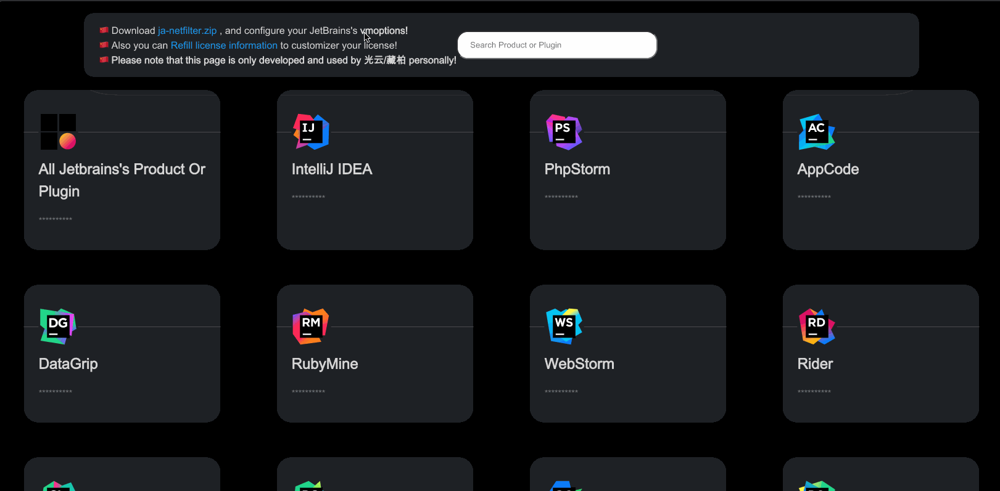
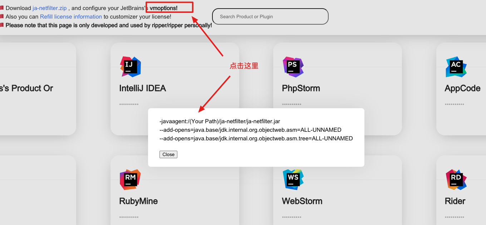

<h1 align="center" style="font-size: 500%">Jetbrains-Help</h1>

```
     ██╗███████╗████████╗██████╗ ██████╗  █████╗ ██╗███╗   ██╗███████╗      ██╗  ██╗███████╗██╗     ██████╗
     ██║██╔════╝╚══██╔══╝██╔══██╗██╔══██╗██╔══██╗██║████╗  ██║██╔════╝      ██║  ██║██╔════╝██║     ██╔══██╗
     ██║█████╗     ██║   ██████╔╝██████╔╝███████║██║██╔██╗ ██║███████╗█████╗███████║█████╗  ██║     ██████╔╝
██   ██║██╔══╝     ██║   ██╔══██╗██╔══██╗██╔══██║██║██║╚██╗██║╚════██║╚════╝██╔══██║██╔══╝  ██║     ██╔═══╝
╚█████╔╝███████╗   ██║   ██████╔╝██║  ██║██║  ██║██║██║ ╚████║███████║      ██║  ██║███████╗███████╗██║
╚════╝ ╚══════╝   ╚═╝   ╚═════╝ ╚═╝  ╚═╝╚═╝  ╚═╝╚═╝╚═╝  ╚═══╝╚══════╝      ╚═╝  ╚═╝╚══════╝╚══════╝╚═╝
```

<p align="center">
    
    
</p>

<p align="center">
    
</p>

<p align="center">
    
    
</p>

<p align="center">
    
</p>

<p align="center">
    
    
    
    
</p>

<p align="center">
    
</p>

# 功能

| 功能                       | DID |
|:-------------------------|:---:|
| Jetbrains全产品支持           |  ✅  |
| Jetbrains全插件支持           |  ✅  |
| 插件库全自动订阅官网更新             |  ✅  |
| 公私钥/证书, 自动生成管理           |  ✅  |
| power.conf文件自动配置         |  ✅  |
| ja-netfilter.zip自动打包     |  ✅  |
| 自定义License Show          |  ✅  |
| 支持实时搜索                   |  ✅  |
| 插件默认按名称排序                |  ✅  |
| 支持local/jar/dockerfile运行 |  ✅  |
| 单码全家桶激活支持                |  ✅  |
| ……                       | ☑️  |

## 部署

#### Docker
支持docker快速部署, 并开放端口 `10768`  
```bash
docker compose build && docker compose up -d
```

更新需删除镜像后重新build下即可.   

#### Jar
到 [Release](https://github.com/RipperTs/Jetbrains-Help/releases) 下载最新版本的jar包, 然后执行
```bash
java -jar jetbrains-help-1.0.0.jar
```

默认监听端口 `10768`, 可通过 `--server.port=10768` 修改端口.  

## 激活使用

### 配置 IDE VM Options
分两种情况, 如果能直接打开并进入 IDE, 则直接点击 `Help` -> `Edit Custom VM Options`.   
如果无法进入 IDE, 则需要手动修改 `idea.vmoptions` 文件 (在软件安装目录下, Mac用户自行百度文件位置).  

在文件末尾添加如下内容:  
```
-javaagent:/(Your Path)/ja-netfilter/ja-netfilter.jar
--add-opens=java.base/jdk.internal.org.objectweb.asm=ALL-UNNAMED
--add-opens=java.base/jdk.internal.org.objectweb.asm.tree=ALL-UNNAMED
```
  

然后重启软件即可.  

#### 示例
Windows下的示例:
```
-javaagent:C:\Users\Administrator\ja-netfilter\ja-netfilter.jar
--add-opens=java.base/jdk.internal.org.objectweb.asm=ALL-UNNAMED
--add-opens=java.base/jdk.internal.org.objectweb.asm.tree=ALL-UNNAMED
```

### 输入激活码
在页面中找到要激活的code,复制到IDE中的激活框中,点击激活即可.  

## 注意事项
- 本项目仅供学习交流使用, 请勿用于商业用途.
- 请勿滥用, 请勿滥用, 请勿滥用.
- 请勿用于非法用途, 否则后果自负.
- 自行搭建的服务需要开SSL,否则copy失效.  

## 相关链接
- [Jetbrains官网](https://www.jetbrains.com/)
- [Jetbrains插件库](https://plugins.jetbrains.com/)
- [Jetbrains激活码(演示功能可用)](https://jb.supercopilot.top/)

